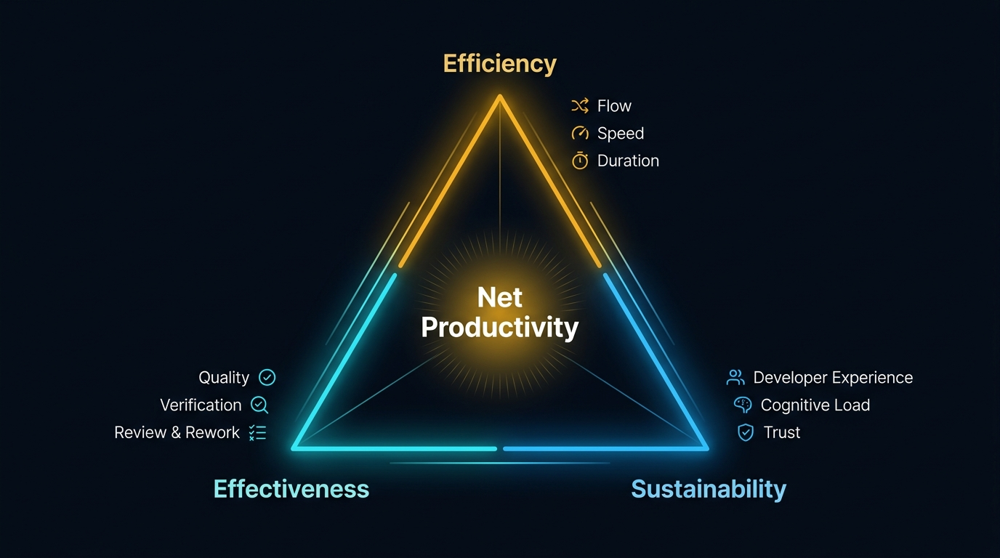

AI can generate code faster. But does that mean software is delivered faster?

Not necessarily.

A change that is produced faster still needs to be reviewed, validated, integrated, and maintained. If AI reduces implementation time but additional effort appears during review or verification, the productivity gain can look very different when the whole development workflow is considered.

This question was the starting point of my Master’s thesis at the University of Helsinki. As part of the work, we had the opportunity to explore the question in practice through an industrial study within the Alternative Futures of Software Work project. The work introduced the **AI Productivity Triangle**, a way of looking at productivity in AI-assisted software development through three dimensions: efficiency, effectiveness, and sustainability.

The industrial study was carried out in collaboration with Basware, a Finnish enterprise software company, where we applied a measurement framework to real software development data. The analysis focused on aggregated workflow patterns rather than individual developer performance. Some of the results challenged a simple assumption: more AI use does not automatically translate into faster software delivery.

## Looking beyond coding time

The study combined three types of information: GitHub repository telemetry, Jira workflow data, and developer surveys, each capturing a different part of the development process.

AI usage was recorded at the pull-request level in Jira using four self-reported categories: None, Low, Medium, and High. This gave us a lightweight way to compare development patterns across reported levels of AI assistance without directly monitoring individual developers’ use of AI tools.

GitHub and Jira data were then used to examine coding and review durations, pull request size, review activity, rework, and post-merge signals. Developer surveys added information that repository telemetry cannot capture directly, including trust in AI-generated suggestions, cognitive load, interruptions, learning, and perceived usefulness.

The measurement framework translated the three dimensions of the AI Productivity Triangle into practical measures that could be examined using these different data sources. For example, efficiency was examined through measures of development flow and duration, effectiveness through review, rework, and quality signals, and sustainability through developer-reported experience. The goal was not to produce a single productivity score. Instead, we looked at the different measures together to understand where AI appeared to help, where extra effort showed up, and what trade-offs became visible.

## More AI use did not automatically mean faster delivery

One of the clearest findings was that more reported AI use did not consistently mean faster end-to-end delivery.

Developers reported clear benefits from AI assistance for repetitive implementation, debugging, testing, documentation, solution exploration, and code understanding. AI-assisted work was also often associated with shorter implementation stages.

But those implementation gains did not tell the whole story.

Instead, differences in delivery time appeared to be more closely connected to pull request size, task complexity, and what happened during review. Larger feature-oriented changes remained open longer and often required more coordination, review, and refinement.

Reported AI use alone was therefore not enough to explain differences in delivery performance.

Two pull requests can involve similar reported levels of AI assistance while having very different outcomes because one is a small, localized change and the other touches a complex part of an existing system.

The context of the work matters.

## What happens after implementation gets faster?

A second recurring pattern was the amount of activity that occurred after implementation.

Post-review changes were common, with many pull requests receiving additional commits after review had already started. That is not necessarily a sign of poor-quality work. Changes during review can come from reviewer feedback, additional testing, clarification, integration issues, or simply adapting the change to the conventions of the codebase. But it does show that producing the initial implementation is only part of the work.

In many of the observed pull requests, review stages were considerably longer than coding stages. Looking only at how quickly the first version of a change was produced would therefore give an incomplete picture of productivity.

AI can make producing code easier without making understanding that code equally easy. Review still requires someone to understand what changed, why it changed, and whether it belongs in the system. This raises an interesting question: what happens when our ability to produce code grows faster than our ability to review it?

Pull request size mattered too. Larger and more complex feature changes generally involved greater review and refinement effort, requiring more context and coordination before they could be integrated. As AI makes it easier to produce substantial amounts of code quickly, there may be even more reason to keep changes small and manageable.

There is another side to moving faster. AI can make it easier to start or explore several tasks, potentially encouraging more work to happen in parallel. In our surveys, developers described AI tools themselves as a source of interruptions and context switching in some situations. The ability to move faster can therefore come with a cost: developers may need to divide their attention across more tasks, conversations, or generated outputs that still need to be followed through.

Taken together, these findings suggest that AI assistance may shift, rather than simply eliminate, engineering effort. Faster implementation can coexist with substantial work in review, validation, and coordination, while managing more work in parallel may introduce its own demands.

## What happens as AI moves into review?

There was another interesting pattern in the study: reported AI use was concentrated primarily in implementation activities, with very little reported use during code review. Human reviewers therefore remained responsible for much of the contextual validation and judgment required before changes could be merged.

This may not remain true for long.

As AI becomes more involved in reviewing, testing, and validating software changes, where engineers spend their time may change again. Tasks that currently require substantial human effort may become increasingly AI-assisted, while new kinds of verification and oversight may appear.

The review patterns observed in the study should therefore not be treated as fixed. Today's bottlenecks may become smaller, move elsewhere, or change form altogether.

As AI reaches more stages of software development, productivity measurement will need to follow the work. The question is not only what gets faster, but where the work moves next.

## GitHub can't tell us everything

Workflow data told us a lot, but the developer surveys showed why telemetry alone is not enough. Developers generally reported positive experiences with AI assistance, particularly for repetitive work, implementation flow, learning, and code understanding.

But the surveys also showed another side of the story. Responses highlighted the need for verification and showed that factors such as trust, interruptions, task switching, workload, and fatigue are relevant when evaluating AI-assisted work.

None of these signals is visible from a GitHub pull request.

A pull request may look efficient in repository data while still requiring substantial verification or cognitive effort. The numbers show what happened in the workflow, but not necessarily the effort, attention, and verification the work required.

## Productivity involves trade-offs

These observations are why the AI Productivity Triangle looks at productivity through three complementary dimensions:

- **Efficiency**: How quickly work moves through the development process.
- **Effectiveness**: The quality and correctness of software changes, including the verification and rework they require.
- **Sustainability**: Whether developers and teams can maintain productive ways of working over time, including developer experience, trust, cognitive load, and flow.

At the center of the triangle is **net productivity**, representing the overall balance across these three dimensions. An improvement in one dimension should not automatically be interpreted as an overall productivity gain. What matters is what happens across the three dimensions together.

Faster implementation, for example, may represent a clear efficiency gain. But if it coincides with substantially greater verification effort, rework, or cognitive load, the overall productivity benefit may be smaller than the improvement in coding speed suggests.

Similarly, careful review may make a pull request slower while protecting quality and maintainability. A slower workflow should therefore not automatically be interpreted as lower productivity.

Net productivity is about understanding this balance. The AI Productivity Triangle helps make these relationships visible, while the measurement framework provides ways to examine them in practice. The aim is not to collapse everything into a single productivity score, but to ask: where are the gains, where does extra effort appear, and what trade-offs emerge between efficiency, effectiveness, and sustainability?

## What does this mean for organizations?

The industrial study points to a few practical lessons.

Coding speed, lines of code, pull request counts, or reported AI use do not tell the productivity story on their own. Pull request size, task complexity, review effort, and rework provide important context for understanding what those numbers actually mean.

The same applies to engineering telemetry. Repository data can show what happened in the workflow, but developer feedback helps explain what the work required in terms of trust, validation, cognitive effort, and interruptions.

Perhaps most importantly, organizations should look beyond the activity AI accelerates first. Faster coding is useful, but the real question is what happens to the rest of the workflow. As AI changes different parts of the development process, organizations need to look at whether efficiency, effectiveness, and sustainability improve together.

## So, what should we measure next?

The industrial study answered some questions, but it also highlighted a broader challenge: there may not be a fixed way to measure AI-assisted productivity.

AI assistance is already extending beyond coding into testing, review, validation, and other development activities. As AI becomes involved in more parts of the workflow, the work changes with it. Activities that are bottlenecks today may become easier to automate, while new constraints and trade-offs emerge elsewhere.

Measuring AI-assisted productivity is therefore a moving target. Organizations need to consider what to measure, how to combine different sources of evidence, and how to interpret the trade-offs those measures reveal. A shorter implementation stage may be valuable, for example, but its meaning depends on what happens to review effort, rework, quality, and developer experience.

The challenge is not simply to find better metrics. It is to understand how those metrics should be interpreted together as software development itself changes.

Our industrial study captures one point in this transition. As AI capabilities and development practices continue to evolve, the measures may change too. But the underlying challenge remains:

As AI reshapes where engineering effort is spent, what should we measure, how should we interpret it, and how should we navigate the trade-offs?
